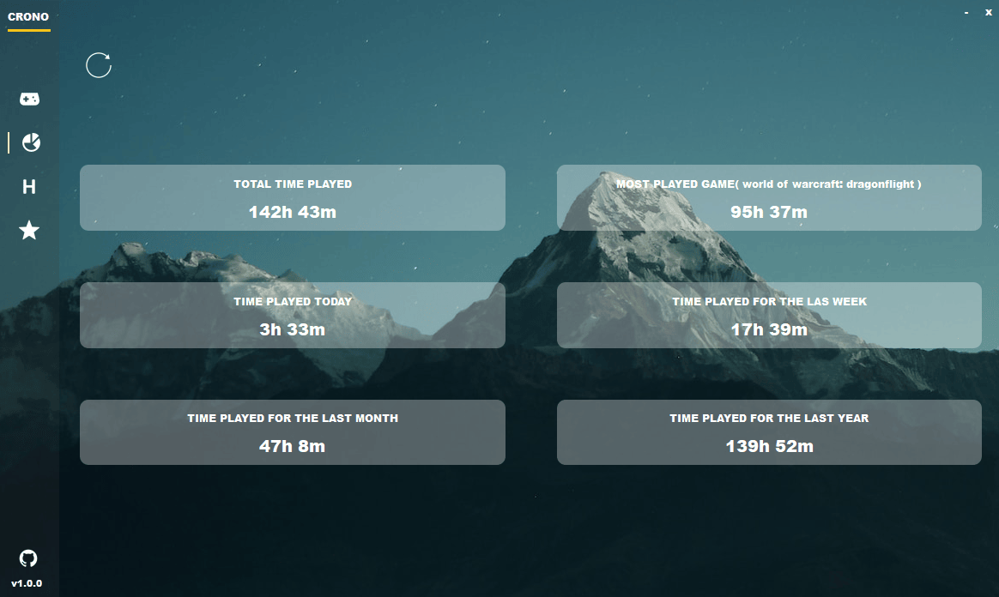
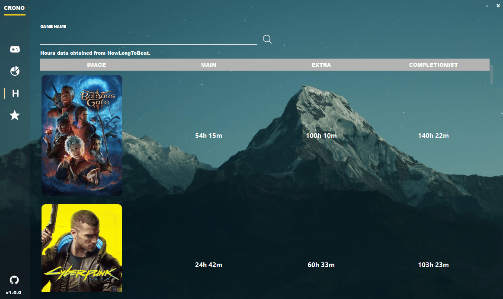

# Crono

Crono is a app built with  [QT C++](https://www.qt.io) that allows you to track the time of apps running, games and in app HowLongToBeat.

### Download Links:
- [Download](https://github.com/illud/crono/releases/download/v1.0.0/crono-v1.0.0.rar)
- [Source Code](https://github.com/illud/crono/archive/refs/tags/v1.0.0.zip)
  

## Build
windeployqt.exe --no-translations "C:\release-path\release\notepad.exe"
